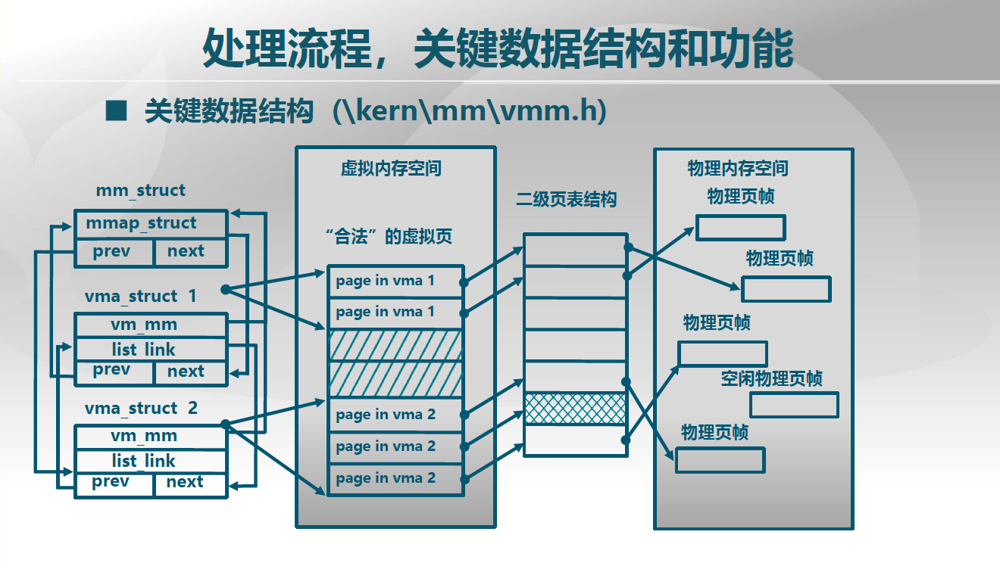

# lec10: lab3 SPOC思考题

## 视频相关思考题
---
### 10.1 实验目标：虚存管理
---

1. 缺页和页访问非法的返回地址有什么不同？
   - 缺页异常的返回地址由硬件设置到CR2寄存器中，页访问非法的返回地址软件可以修改。缺页异常的返回地址是触发异常的指令；页访问非法的返回地址可能是直接杀死程序。
2. 虚拟内存管理中是否用到了段机制？
   - 使用了段机制，因为需要先开启段机制然后再开启页机制。
3. ucore如何知道页访问异常的地址？
   - 硬件将页访问异常的地址保存在CR2寄存器中。

### 10.2 回顾历史和了解当下
---

1. 中断处理例程的段表在GDT还是LDT？
   - GDT
2. 物理内存管理的数据结构在哪？
   - Page
3. 页表项的结构？
   - 第12-31位：物理地址基址
   - 第9-11位：AVL，可利用位
   - 第8位：Global
   - 第7位：0
   - 第6位：Dirty 脏位，是否写过
   - 第5位：Accessed，是否读过
   - 第4位：Cache Disabled
   - 第3位：Write Through 写直达
   - 第2位：User/Supervisor，ring 3是否可访问
   - 第1位：Read/Write，保护位
   - 第0位：Present，是否有效
4. 页表项的修改代码？
   - 在缺页异常处理的代码中。
5. 如何设置一个虚拟地址到物理地址的映射关系？
   - 修改页表项，设置逻辑页号到物理页帧号的映射。
6. 为了建立虚拟内存管理，需要在哪个数据结构中表示“合法”虚拟内存
   - 在页表项中设置有效位。

### 10.3 处理流程、关键数据结构和功能
---

1. swap_init()做了些什么？

   - 初始化对换分区。

2. vmm_init()做了些什么？

   - 初始化逻辑地址空间。

3. vma_struct数据结构的功能？

   - 维护逻辑地址空间的合法区域，是连续的一段地址空间。

4. mmap_list是什么列表？

   - 是mm_struct中按照vma起始地址排序的列表，和vma_struct中的list_link形成整个链表，用于维护逻辑地址空间的映射。

5. 外存中的页面后备如何找到？

   - 通过swap_in_page。

6. vma_struct和mm_struct的关系是什么？

   - vma_struct管理一块连续的合法虚拟地址空间，mm_struct管理整个虚拟地址空间。

7. 画数据结构图，描述进程的虚拟地址空间、页表项、物理页面和后备页面的关系；

   

### 10.4 页访问异常
---

1. 页面不在内存和页面访问非法的处理中有什么区别？对应的代码区别在哪？
   - 页面不在内存则应换入相应的物理页面；访问非法则应报错。代码在do_pgfault中产生区别，通过find_vma来判断访问的虚拟地址是否是合法地址，继而进行后续操作。
1. find_vma()做了些什么？
   - 假设查找的是合法虚拟地址，查找其所在的vma数据结构。
1. swapfs_read()做了些什么？
   - 读取外存中的页面内容。
1. 缺页时的页面创建代码在哪？
   - 在page_insert中。
1. struct rb_tree数据结构的原理是什么？在虚拟管理中如何用它的？
   - 采用红黑树，虚存管理利用它加快查找。
1. 页目录项和页表项的dirty bit是何时，由谁置1的？
   - 页面修改时由硬件置1。
1. 页目录项和页表项的access bit是何时，由谁置1的？
   - 页面访问时由硬件置1。

### 10.5 页换入换出机制
---

1. 虚拟页与磁盘后备页面的对应有关系？
   - 在PTE中，通过swap_entry_t记录其关系：存在位为1表示虚拟页和内存中的页面有对应关系，为0表示虚拟也和磁盘扇区中的后备页面有对应关系。
1. 如果在开始加载可执行文件时，如何改？
1. check_swap()做了些什么检查？
   - 检查虚拟页和物理页的映射、页面换入换出的正确性，以及页面置换算法FIFO的正确性。
1. swap_entry_t数据结构做什么用的？放在什么地方？
   - 记录虚拟页和磁盘扇区中的页面的对应关系，放在PTE中。
1. 空闲物理页面的组织数据结构是什么？
   - free_list
1. 置换算法的接口数据结构？
   - swap_manager

================

## 小组思考题
---
(1)请参考lab3_result的代码，思考如何在lab3_results中实现clock算法，给出你的概要设计方案。可4人一个小组。要求说明你的方案中clock算法与LRU算法上相比，潜在的性能差异性。进而说明在lab3的LRU算法实现的可能性评价（给出理由）。

(2) 理解内存访问的异常。在x86中内存访问会受到段机制和页机制的两层保护，请基于lab3_results的代码（包括lab1的challenge练习实现），请实践并分析出段机制和页机制各种内存非法访问的后果。，可4人一个小组，，找出尽可能多的各种内存访问异常，并在代码中给出实现和测试用例，在执行了测试用例后，ucore能够显示出是出现了哪种异常和尽量详细的错误信息。请在说明文档中指出：某种内存访问异常的原因，硬件的处理过程，以及OS如何处理，是否可以利用做其他有用的事情（比如提供比物理空间更大的虚拟空间）？哪些段异常是否可取消，并用页异常取代？

## 课堂实践练习

请分析ucore中与物理内存管理和虚拟存储管理相关的数据结构组织；分析访问这些数据结构的函数，说明其对存储管理相关数据结构的修改情况；最后通过一个数据结构图示，描述进程的虚拟地址空间、页表项、物理页面和后备页面的关系。

 * struct Page
 * struct mm_struct
 * struct vma_struct
 * struct swap_entry

## v9-cpu相关
---
(1)分析并编译运行v9-cpu git repo的testing branch中的,root/etc/os_lab2.c os_lab3.c os_lab3_1.c,理解虚存机制是如何在v9-cpu上实现的，思考如何实现clock页替换算法，并给出你的概要设计方案。

(2)分析并编译运行v9-cpu git repo的testing branch中的,root/etc/os_lab2.c os_lab3.c os_lab3_1.c，理解内存访问异常的各种情况，并给出你的分析结果。
